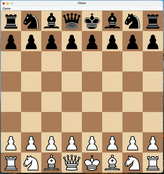

# Chess

A Fully Object-Oriented Chess, written in pure Java


## Features

- Support Custom [FEN](https://en.wikipedia.org/wiki/Forsyth–Edwards_Notation)
- Multiplayer
- Undo Move
- Plays sound
- Support Stalement and Checkmate edge Cases
- Support [En Passant](https://en.wikipedia.org/wiki/En_passant) Move


## Demo




## Documentation
You can visit the online Documentation on here: [Documentation](https://itsamirhn.github.io/Chess)


## Run Locally

1. Install JRE 21 or higher
2. Download the latest `Chess.jar` file from [releases page](https://github.com/itsamirhn/Chess/releases)
3. Run the following command:
```bash
  java -jar Chess.jar
```

## Running Tests

The project use [Maven](https://maven.apache.org/) as build automation tool. To run tests, run the following command:

```bash
  mvn test
```


## Authors

- [@itsamirhn](https://github.com/itsamirhn)

